# **About WebServ**

*This project has been created as part of the 42 curriculum by [Filipe Lima (flima)](https://github.com/Filipe-FLima), [Kateryna Zinchuk (kzinchuk)](https://github.com/katerynazinchuk) and [Yuleum Park (yulpark)](https://github.com/YuRuM0).*

## **Description**
WebServ is a C++ HTTP server built from scratch as part of the 42 curriculum. It manages concurrent connections using non-blocking sockets monitored with `poll()`, parses HTTP/1.1 messages, and generates spec-compliant responses — without relying on any external networking libraries.

### **Architecture**

WebServ follows a single-process, event-driven architecture centered on a `poll()` loop that multiplexes all I/O — client connections, listening sockets, and CGI pipes — without blocking.

On startup, the configuration file is parsed into a `WebservConf` object, which holds all `ServerConf` and `Location` instances. The available IP:port endpoints are then handed to the networking layer, which creates one non-blocking socket per endpoint via `socket()`, `bind()`, `listen()`, and `fcntl()`.

Once running, `poll()` monitors all file descriptors in a single loop. When a `POLLIN` event arrives on a client fd, the raw bytes are fed into the HTTP parser, which returns `COMPLETE`, `INCOMPLETE`, `ERROR`, or `MAX_BODY_SIZE`. Since all sockets are set to non-blocking mode, no single client can stall the server — `poll()` returns as soon as any file descriptor is ready and the loop processes only that event before moving on. Each accepted connection is assigned its own `Connection` object, keyed by file descriptor, which holds an independent HTTP parser state, input buffer, output buffer, and activity timestamp. This means concurrent clients are fully isolated: a slow upload on one fd does not affect parsing or response on another. WebServ therefore handles multiple simultaneous clients within a single process and a single thread, with no forking per connection and no busy-waiting.

On a complete request, `responseHandler()` takes over: it matches the request to a server and location block, resolves the filesystem path, and dispatches to the appropriate handler — `GET` for static files and autoindex, `POST` for multipart file uploads, and `DELETE` for file removal. If the resolved path maps to a CGI script, the request is handed back to the networking layer, which launches the script via `fork()` and `execve()` and monitors the CGI pipe through the same `poll()` loop. In all other cases, the response string is built directly and written to the client on the next `POLLOUT` event.

<p align="center">
	
</p>

## **Instructions**

### Features

| Feature | Details |
|---|---|
| **HTTP methods** | `GET`, `POST`, `DELETE` |
| **Static file serving** | Reads and serves files from the configured root directory |
| **Autoindex** | Generates an HTML directory listing when no index file is found |
| **File uploads** | `multipart/form-data` with support for multiple files per request |
| **File deletion** | Removes files via `DELETE` with permission checks |
| **CGI** | Executes `.py` scripts via `fork()` + `execve()` |
| **HTTP redirections** | Configured per location block, returns `3xx` responses |
| **Error pages** | Default error pages for `400`, `403`, `404`, `405`, `408`, `409`, `413`, `415`, `500`, `502`, `504`— overridable per server block via config |
| **Connection timeout** | Inactive connections are closed after a configurable timeout |
| **Config file** | nginx-style `.conf` with support for multiple server and location blocks |

### **usage**

**Requirements**

- C++20 compatible compiler (`c++`)
- POSIX-compliant OS (Linux or macOS)

**Compilation**

```bash
make        # build
make re     # rebuild from scratch
make clean  # remove object files
make fclean # remove object files and binary
```

**Execution**
```bash
./webserv                          # uses conf_files/default.conf
./webserv path/to/config.conf      # uses a custom config file
```

The default config starts two servers on ports `8080` and `8082`.

**Browser**

Open `http://localhost:8080` in any browser to access the demo website included in the `data/` directory. It covers all supported features and includes two CGI-powered pages:
- a page that lists the filenames of all uploaded files
- a page that lists and displays uploaded images inline

**Test with curl**
```bash
# GET a static file
curl -v http://localhost:8080/

# Upload a file
curl -v -X POST http://localhost:8080/upload \
  -F "file=@/path/to/file.txt"

# Delete a file
curl -v -X DELETE http://localhost:8080/upload/file.txt

# Test redirection
curl -v http://localhost:8080/concerts
```

**Load test with siege**
```bash
siege -c 10 -t 30s http://localhost:8080/
```
`-c` sets the number of concurrent users, `-t` sets the duration.
<p align="center">
  
</p>

## **Configuration**

WebServ uses an nginx-style configuration file. Each `server` block defines a virtual server,
and `location` blocks define how specific URI prefixes are handled. If a `location` does not
specify a `root`, it inherits the server-level `root`.

```nginx
server {
    listen 127.0.0.1:8080;          # IP and port to bind
    root /data;                      # default root for all locations
    client_max_body_size 5M;         # max request body size (supports M suffix)

    error_page 404 /data/error_pages/404.html;   # custom error pages (optional)

    # redirection — returns a 3xx response with a Location header
    location /concerts {
        return 301 https://example.com;
    }

    # root location — serves the homepage and handles uploads
    location / {
        root /data;
        index /html/index.html;
        allowed_methods GET POST;
        upload_store /upload;        # upload destination directory
        autoindex on;                # directory listing when no index is found
    }

    # CGI — executes .py scripts via the specified interpreter
    location /cgi-bin {
        root /data;
        cgi_pass .py /usr/bin/python3;		# maps .py files to the Python interpreter
        allowed_methods GET POST DELETE;
        autoindex off;
    }

    # upload location — allows GET, POST and DELETE on uploaded files
    location /upload {
        root /data/upload;
        allowed_methods GET POST DELETE;
        autoindex off;
    }
}
```

A second `server` block can be added to the same file to run another server on a different port.
Each server must listen on a unique port.

## Resources

### HTTP & web servers
- [What is a web server — MDN](https://developer.mozilla.org/en-US/docs/Learn_web_development/Howto/Web_mechanics/What_is_a_web_server)
- [HTTP documentation — MDN](https://developer.mozilla.org/en-US/docs/Web/HTTP)
- [HTTP Crash Course — YouTube](https://www.youtube.com/watch?v=UMwQjFzTQXw)
- [HTTP Deep Dive — YouTube](https://youtu.be/AlkDbnbv7dk)

### Configuration parsing
- [Writing a config parser — YouTube](https://www.youtube.com/watch?v=0c8b7YfsBKs)
- [nginx beginner's guide](https://nginx.org/en/docs/beginners_guide.html)
- [nginx request processing](https://nginx.org/en/docs/http/request_processing.html)
- [nginx directive index](https://nginx.org/en/docs/dirindex.html)

### Networking & I/O multiplexing
- [Beej's Guide to Network Programming — YouTube](https://www.youtube.com/watch?v=XXfdzwEsxFk)
- [Networking playlist — YouTube](https://www.youtube.com/playlist?list=PL9IEJIKnBJjH_zM5LnovnoaKlXML5qh17)
- [poll() and epoll() — YouTube](https://www.youtube.com/watch?v=D26sUZ6DHNQ)
- [The method to epoll's madness — Medium](https://copyconstruct.medium.com/the-method-to-epolls-madness-d9d2d6378642)
- [Non-blocking I/O — YouTube](https://www.youtube.com/watch?v=g2fT-g9PX9o)
- [How multiple tabs share the same port — Medium](https://medium.com/@mohonsaha/how-do-multiple-browser-tabs-use-the-same-port-a-networking-insight-for-developers-afe4a0538761)
- [epoll man page — Linux](https://man7.org/linux/man-pages/man7/epoll.7.html)

### CGI
- [Common Gateway Interface — Wikipedia](https://en.wikipedia.org/wiki/Common_Gateway_Interface)
- [CGI overview — NCSA](https://www6.uniovi.es/~antonio/ncsa_httpd/cgi/)
- [CGI tutorial](http://www.mnuwer.dbasedeveloper.co.uk/dlearn/web/session01.htm)
- [RFC 3875 — The CGI Specification](https://datatracker.ietf.org/doc/html/rfc3875)

---

### AI usage

[Claude](https://claude.ai) and [ChatGPT](https://chatgpt.com) were used as debugging and design-review tools throughout the project. Their primary use was in Part 3 (config parsing, request routing, CGI integration, static file serving, and error handling) — specifically for reasoning through edge cases, reviewing logic, and identifying bugs from raw logs and code snippets. All code was written, understood, and validated by the team.